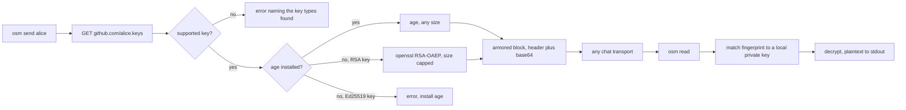

<div align="center">

<strong>Send an encrypted message through any chat, using a GitHub username as the address.</strong>

[](https://github.com/gufranco/osm/actions/workflows/ci.yml)
[](LICENSE)
[](#development)
[](#portability)

<p align="center">
  <a href="#quick-start"><strong>Quick start</strong></a> &nbsp;|&nbsp;
  <a href="#how-it-works">How it works</a> &nbsp;|&nbsp;
  <a href="#what-it-does-not-do"><strong>Security limits</strong></a> &nbsp;|&nbsp;
  <a href="#troubleshooting">Troubleshooting</a>
</p>

</div>

**5** commands · **2** crypto engines · **4** key hosts · **153** tests · **POSIX sh** · **macOS, Linux, BSD** · **zero** runtime dependencies beyond `age`

> [!NOTE]
> **Threat model, courtesy of [James Mickens](https://www.schneier.com/blog/archives/2015/08/mickens_on_secu.html):** you are either dealing with Mossad or not-Mossad.
>
> `osm` is a not-Mossad tool and it is *excellent* at its job, which is defeating a chat retention policy. Your database password is now safe from the intern with workspace admin, from the backup tape nobody remembers provisioning, and from whoever inherits that channel in 2031. Genuinely useful. Also roughly the security equivalent of locking your car in a neighbourhood where nobody was going to steal it.
>
> Against the Mossad, this repository is an elaborate way to feel productive. They will read the plaintext off your screen while `age` is still picking a nonce, and then they will do something to your laptop firmware that has its own Wikipedia article. YOU'RE GONNA DIE AND THERE'S NOTHING THAT YOU CAN DO ABOUT IT. You will, however, die with a 96% covered test suite and a fully POSIX-compliant shell script, which is more than most people manage.
>
> The [security limits](#what-it-does-not-do) section is where the honest part lives. Read it before trusting this with anything that would end a career.

---

```console
$ osm send alice 'database password: correct-horse-battery-staple'
-----BEGIN OSM MESSAGE-----
v: 1
alg: age
to: alice
key: SHA256:iD5CQysP5Zu+ugBNVoQSDruYFlSFJSJiFQwUXbpdGh4

YWdlLWVuY3J5cHRpb24ub3JnL3YxCi0+IHNzaC1lZDI1NTE5IGlENUNReSBhWDNu
UjZQd2NCRWRhVGJZbUFVWjZHUUFEeUJIUGNZTFVoMkc5ZmVRR0ZzCg==
-----END OSM MESSAGE-----
osm: copied to the clipboard with pbcopy.
```

The block is preceded by a short note telling a first-time recipient what they are looking at and how to open it. It sits above `BEGIN`, where the parser already ignores everything, so it can never corrupt a message. Turn it off with `--no-banner` or `OSM_BANNER=0`.

Paste all of it into Slack, Telegram, a Jira ticket, or an email. Alice runs one command:

```console
$ pbpaste | osm read
database password: correct-horse-battery-staple
```

No key exchange, no keyserver, no accounts. Alice needs nothing beyond the SSH key her GitHub profile already publishes.

---

## The problem

Pasting a credential into a chat window puts it in someone else's database. Deleting the message afterwards does not remove it from server-side logs, backups, or the recipient's notification history. The usual workaround is to paste it anyway and hope.

## The solution

Every GitHub account already publishes its SSH public keys at `github.com/<user>.keys`. That is a public key the recipient already controls and can already use. `osm` encrypts to it, and the recipient decrypts with the private key sitting in their `~/.ssh`.

<table>
<tr>
<td width="50%" valign="top">

### Address by username

`osm send alice` fetches Alice's published keys and encrypts to all of them, so she can read the message on any machine she owns.

</td>
<td width="50%" valign="top">

### Nothing to exchange first

No shared secret, no passphrase over the phone, no keyserver. The only input is a GitHub username.

</td>
</tr>
<tr>
<td width="50%" valign="top">

### Inert payload

The output is armored data, never a shell command. A tampered paste cannot execute code on the recipient's machine.

</td>
<td width="50%" valign="top">

### Ed25519 and RSA

Uses `age` when present, which reaches modern `ssh-ed25519` keys and carries any message size.

</td>
</tr>
<tr>
<td width="50%" valign="top">

### Finds the right key

Records the recipient key fingerprint and matches it against local keys, so a non-default filename works without flags.

</td>
<td width="50%" valign="top">

### One reviewable file

Ships as a single 549-line `dist/osm` with no runtime dependency on sibling files, so a cautious recipient can read it before running it.

</td>
</tr>
</table>

## Quick start

### Prerequisites

| Tool | Why | Install |
|:-----|:----|:--------|
| POSIX `sh` | The tool itself | Preinstalled everywhere. `bash` is not required |
| `curl`, `ssh-keygen`, `openssl` | Key fetch, fingerprints, base64 | Preinstalled on macOS and Linux |
| [`age`](https://github.com/FiloSottile/age) | The encryption engine | `brew install age` or `apt install age`. Pulled in automatically by the tap |
| `qrencode` | Optional, only for `--qr` | `brew install qrencode` or `apt install qrencode` |

> [!IMPORTANT]
> Without `age` the tool still works, but falls back to RSA. That path cannot encrypt to an Ed25519 key and caps messages at 470 bytes. Most GitHub accounts publish Ed25519 keys today, so `age` is what makes this useful in practice.

### Setup

```bash
brew tap gufranco/osm https://github.com/gufranco/osm
brew install gufranco/osm/osm
```

The tap is this repository. Homebrew needs the explicit URL because the repo is not named `homebrew-osm`, and that keeps the formula, the source and the release pipeline in one place instead of a second repo that drifts.

Or from source, which also installs the man page and shell completions:

```bash
git clone https://github.com/gufranco/osm.git
cd osm
make install
```

Every release also attaches a ready-to-run `dist/osm` to the [GitHub release](https://github.com/gufranco/osm/releases), so a recipient can download one file, read it, and run it.

### Verify

```console
$ osm doctor
age            ok       v1.3.1
curl           ok
ssh-keygen     ok
openssl        ok       OpenSSL
identities     ok       1 usable key pair(s) under ~/.ssh
```

## Usage

| Command | Purpose |
|:--------|:--------|
| `osm send <user>[@host] [message]` | Encrypt to a user on GitHub, GitLab, Codeberg, SourceHut, or any self-hosted forge. Reads stdin when no message argument is given |
| `osm read [file]` | Decrypt. Reads stdin when piped, otherwise reads the clipboard |
| `osm keys <user>` | List the keys `osm` can encrypt to, with fingerprints |
| `osm doctor` | Check the local environment and print a remedy for each failure |
| `osm version` | Print the version and the active engine |

| Flag | Effect |
|:-----|:-------|
| `--to <target>` | Add a recipient. Repeat for several |
| `--sign <you>` | Sign as a user whose published key you hold |
| `--accept-new-key` | Accept a recipient whose pinned keys changed |
| `--require-signature` | On read, refuse a message that carries no signature |
| `--expires <when>` | Mark the message stale after `30m`, `6h`, `7d` and so on |
| `--ignore-expiry` | On read, open a message the sender marked as expired |
| `--keys-file <path>` | Add recipients from a local public key file |
| `--key <prefix>` | Encrypt to one key only, chosen by fingerprint prefix |
| `--json` | Print machine readable output |
| `--qr` | Print the message as a QR code instead of text |
| `--no-banner` | Omit the short note that tells the recipient what the block is |
| `--identity <path>` | Decrypt with a specific private key |
| `--no-clipboard` | Do not copy the result to the clipboard |

### Key hosts

| Host | Recipient syntax | Status |
|:-----|:-----------------|:-------|
| GitHub | `alice` | default |
| GitLab | `alice@gitlab` | verified |
| Codeberg | `alice@codeberg` | verified |
| SourceHut | `alice@sourcehut` | verified |
| Self-hosted Gitea, Forgejo, GitLab | `alice@git.example.com` | any host serving `/<user>.keys` |
| Bitbucket | not supported | it publishes no public key endpoint, so use `--keys-file` |

```bash
printf 'the secret' | osm send alice          # stdin keeps it out of the process list
osm send alice:iD5CQy 'only to that one key'  # pin one key by fingerprint prefix
osm send bob@gitlab 'works across forges'     # gitlab, codeberg, sourcehut, self-hosted
osm send --to alice --to bob@codeberg 'hi'    # one message, several people
osm read                                      # with nothing piped, reads the clipboard
```

> [!TIP]
> Pipe the secret on stdin rather than passing it as an argument. An argument is visible to every other user on the machine through the process list.

## How it works



### Engines

| Engine | Recipient keys | Size limit | Integrity |
|:-------|:---------------|:-----------|:----------|
| `age`, used whenever installed | `ssh-ed25519` and `ssh-rsa` | none in practice | authenticated encryption |
| `openssl` fallback | `ssh-rsa` only | 470 bytes at 4096-bit, 214 at 2048-bit | confidentiality only, no integrity check |

The fallback exists so a recipient who cannot install anything still receives short secrets. It is strictly worse and `osm send` says so on stderr. It refuses an Ed25519 recipient and refuses an oversized message rather than emitting something broken.

`osm` implements no cryptography of its own. It delegates entirely to `age` or `openssl`.

## What it does not do

> [!WARNING]
> **An unsigned message proves nothing about who sent it.** Anyone can encrypt to a public key and claim to be anyone. Sign with `--sign <you>` and the recipient can verify it, or refuse unsigned messages entirely with `--require-signature`. Without that, treat the sender as unverified.

| Limit | Detail |
|:------|:-------|
| Unauthenticated header | The `to:` and `key:` lines are routing metadata. Altering them causes an identity error, never a wrong plaintext, because the body is authenticated by `age` |
| Readable by every key on the account | The default lets the recipient read on any device, which also means the message is only as protected as their weakest published key. Pin one with `--key` |
| The forge is the trust anchor | An attacker who adds a key to the recipient's account can read messages sent afterwards. osm pins the fingerprints it saw the first time and refuses to send if they change, which turns a silent takeover into a loud one |

## Troubleshooting

<details>
<summary><strong>decryption failed, and my private key starts with BEGIN OPENSSH PRIVATE KEY</strong></summary>
<br>

Only the `openssl` fallback needs a PEM key. Convert it, keeping the same public key:

```bash
ssh-keygen -p -m PEM -f ~/.ssh/id_rsa
```

</details>

<details>
<summary><strong>no local private key matches this message</strong></summary>
<br>

The message was addressed to a key whose private half is not on this machine. `osm` prints the fingerprint it wanted. Compare against your own:

```bash
ssh-keygen -lf ~/.ssh/*.pub
```

</details>

<details>
<summary><strong>publishes no key osm can encrypt to</strong></summary>
<br>

The account has only ECDSA keys, which neither engine supports. Ask the recipient for an Ed25519 or RSA key.

</details>

<details>
<summary><strong>I have no key pair yet</strong></summary>
<br>

Create one and add the public half at [github.com/settings/keys](https://github.com/settings/keys):

```bash
ssh-keygen -t ed25519 -f ~/.ssh/id_ed25519
```

</details>

## Development

| Command | Description |
|:--------|:------------|
| `make check` | Format, lint, test, and the coverage gate |
| `make build` | Concatenate [`lib/`](lib) into `dist/osm` |
| `make test` | 70 tests via `bats` |
| `make cover` | `kcov`, gated at 91% |
| `make install` | Copy the artifact, man page and completions into place |
| `bash scripts/update-formula.sh <tag>` | Point [`Formula/osm.rb`](Formula/osm.rb) at a release and refresh its checksum. CI runs this automatically on publish |

Sources live in [`lib/`](lib) as 8 modules and are concatenated by [`build.sh`](build.sh) into a single artifact, so the file people install stays reviewable in one pass.

The coverage figure understates the real number. kcov cannot follow background subshells, `PATH`-sandboxed child processes, or binary streams, so the clipboard readers and several engine-failure paths are exercised by passing tests that the instrumented run cannot see. The gate is set to what kcov can actually observe rather than to a number that looks better.

Tests run against real `age` and real `openssl` with real generated keys. The GitHub endpoint is served by a local HTTP server in [`test/helpers/keyserver.py`](test/helpers/keyserver.py), so status codes and `curl` behaviour are genuine rather than stubbed.

| Convention | Source |
|:-----------|:-------|
| Commit format | [Conventional Commits](https://www.conventionalcommits.org/) |
| Shell linting | [`.shellcheckrc`](.shellcheckrc), `enable=all` at zero warnings |
| Formatting | `shfmt -i 2` |
| Bash floor | 3.2, so macOS `/bin/bash` is a supported target |

CI runs the suite on Ubuntu and macOS, runs it again under macOS system Bash 3.2, replays it across every POSIX shell dialect, runs it on Alpine with `bash` uninstalled to prove nothing depends on it, enforces the coverage gate, and performs a real cross-platform check: it encrypts on a macOS runner and decrypts on a Linux runner, comparing checksums.

## Signing

An unsigned message is confidential but anonymous. Signing closes that gap using the same SSH key the sender already publishes.

```console
$ osm send alice --sign you 'this really is from me'

$ osm read message.txt
osm: signature verified against a key published by 'you'.
this really is from me
```

The signature covers the ciphertext and is verified with `ssh-keygen -Y verify` against the keys the claimed sender publishes. A tampered body, or a `from:` swapped to someone else, fails verification and no plaintext is printed. Use `--require-signature` on read to refuse anything unsigned.

## Key pinning

The first message to someone records their fingerprints under `${XDG_CONFIG_HOME:-~/.config}/osm/known_recipients`. If those keys later change, the send stops:

```console
$ osm send alice 'secret'
osm: the keys published by alice changed since you last messaged them.
  pinned:  SHA256:Hb2u7V4cmzORXDF0QulbVVq83T/B6AfX+64LPZS64n0
  current: SHA256:6FV5K276oVndQJv5uxtytvD/KIrimmU/SmWvEgmmdIo
  a key rotation looks exactly like an account takeover from here.
  verify the fingerprint with them out of band, then re-run with --accept-new-key
```

## Smaller conveniences

| Behaviour | Detail |
|:----------|:-------|
| Compression | Payloads are gzipped when that makes them smaller, marked with an `enc:` header. A 4000-byte repetitive payload becomes a 495-byte message, and it raises what fits through the size-capped RSA fallback |
| Weak key warning | A recipient publishing an RSA key below 3072 bits is flagged on every send. Override the floor with `OSM_MIN_RSA_BITS` |
| Clipboard expiry | The copied ciphertext is cleared after 90 seconds, and only if the clipboard still holds it, so nothing you copied since is clobbered. Set `OSM_CLIPBOARD_TIMEOUT=0` to disable |
| Custom clipboard | `OSM_CLIPBOARD_COPY` and `OSM_CLIPBOARD_PASTE` take any command, for tmux, SSH sessions, or anything the built-in detection misses |
| Message expiry | `--expires 6h` records a deadline. Past it, `osm read` refuses and names the deadline, and `--ignore-expiry` overrides. It is advisory: a decryptable blob cannot be un-sent |
| Passphrase clarity | A passphrase-protected key with no terminal to prompt on now says exactly that, instead of failing inside age |
| QR output | `--qr` renders the message for phone-to-laptop transfer, when `qrencode` is installed |

## Portability

The shipped artifact is POSIX `sh` with no bash-only constructs. Every row below was verified by a full encrypt-and-decrypt round trip, not by inspection.

| Shell | Status |
|:------|:-------|
| `dash`, `busybox ash`, `posh` | round trip verified |
| `bash` 3.2 and 5.x, `zsh`, `mksh` | round trip verified |
| `ksh93` | not supported, and it now says so. It lacks `local`, which every other `/bin/sh` provides, so osm exits with a message naming the problem instead of failing cryptically. No BSD or macOS ships ksh93 as `/bin/sh` |

| System | Status |
|:-------|:-------|
| macOS | verified on Tahoe, both Apple Silicon and Intel, including stock `/bin/sh` and LibreSSL |
| Linux, glibc | verified on Debian and Ubuntu |
| Linux, musl | verified on Alpine with `bash` removed entirely |
| FreeBSD, OpenBSD, NetBSD | verified in CI. Each runs a full encrypt-and-decrypt round trip inside a real guest VM. These jobs are non-blocking, because they depend on a third-party VM image download that occasionally returns 503, and a release should not hinge on that |

## Alternatives

[`ssh-vault`](https://github.com/ssh-vault/ssh-vault) solves the same problem as a compiled binary and is worth using if you would rather not run a shell script. There is also an [open request](https://github.com/cli/cli/issues/12202) to build this capability into `gh` directly.

## License

[MIT](LICENSE)
